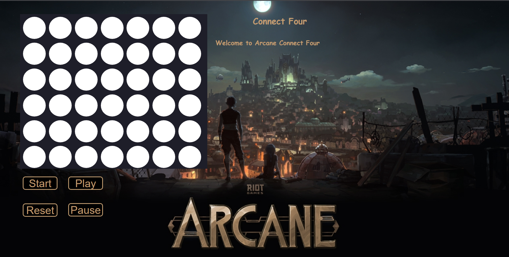

# Connect-Four, Arcane edition!

Everyone knows Connect-Four. I chose this game because it would be a fun first project to create and fully stylize. My love for League of Legends inspired this. 

# [Try it here!](https://chimerical-pie-f73be7.netlify.app/) 

For those of you unfamiliar with the rules, you place a piece in the gameboard. Then the other player places their piece. This goes back and forth until one of you manage to get four in a row, horizontally, vertically, or diagnally. 

# Technologies Used

- JavaScript
- CSS
- HTML
- git

# [Attributions and thanks](./Assets.md)

# Icebox 
 - [X] Adds shaking animation when the board is reset 
-  [ ] Dark/Light mode. 
-  [X] Sound.
+  [ ] Add functionality to let player choose piece color.
-  [X] Victory Music.
-  [ ] Computer AI.
-  [X] Background music.
-  [ ] SUPER MEGA DEATH ROCKET on reset with board shake.